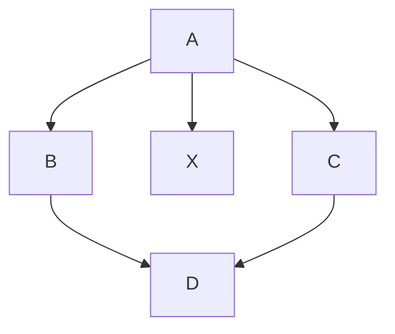
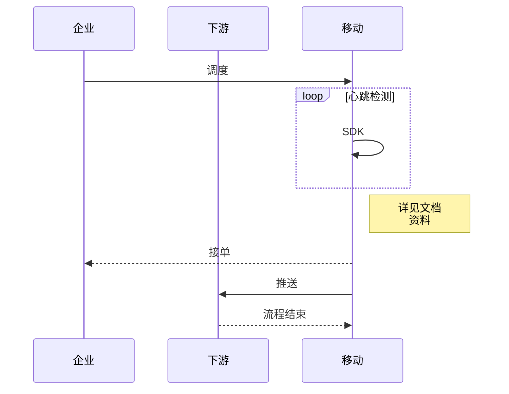

# MarkDown 语法
---

## ■ 标题
- 范围：标题1~标题6
- 加 id 
```
# 标题1 {#head1}
```
- 标题1 和 标题2 的特殊写法
```
标题1
===

标题2
---
```

---

## ■ 粗体 斜体 删除线
- #### 粗体

|MarkDown|HTML|预览|
|--|--|--|
|`**这是粗体**`|`<strong>这是粗体</strong>`|**这是粗体**|
|`__这是粗体__`|`<strong>这是粗体</strong>`|__这是粗体__|

- #### 斜体

|MarkDown|HTML|预览|
|--|--|--|
|`*这是斜体*`|`<em>这是斜体</em>`|*这是斜体*|
|`_这是斜体_`|`<em>这是斜体</em>`|_这是斜体_|

- #### 粗斜体 (实质是斜体和斜体的语法嵌套组合)

|MarkDown|HTML|预览|
|--|--|--|
|`___这是粗斜体___`|`<strong><em>这是粗斜体</em></strong>`|___这是粗斜体___|
|`***这是粗斜体***`|`<strong><em>这是粗斜体</em></strong>`|***这是粗斜体***|
|`**_这是粗斜体_**`|`<strong><em>这是粗斜体</em></strong>`|**_这是粗斜体_**|
|`_**这是粗斜体**_`|`<strong><em>这是粗斜体</em></strong>`|_**这是粗斜体**_|

- #### 删除线

|MarkDown|HTML|预览|
|--|--|--|
|`~~带删除线的字~~`|`<s>带删除线的字</s>`|~~带删除线的字~~|
HTML 的删除线的另一种写法： `<del>带删除线的字</del>`

---

## ■ 列表
- #### 有序列表
在文本前面添加数字加点加空格可以构成有序列表。如下表，最终生成的列表前面的编号和前面的数字没有绝对关系，总是从第一个数字开始依次增加。

|MarkDown|HTML|预览|
|--|--|--|
|`1. 有序列表项 1` <br/> `2. 有序列表项 2`|`<ol>`<br/>`<li>有序列表项 1</li>`<br/>`<li>有序列表项 2</li>`<br/>`</ol>`|1. 有序列表项 1 <br/> 2. 有序列表项 2|
|`1. 有序列表项 1` <br/> `1. 有序列表项 2`|`<ol>`<br/>`<li>有序列表项 1</li>`<br/>`<li>有序列表项 2</li>`<br/>`</ol>`|1. 有序列表项 1 <br/> 2. 有序列表项 2|
|`5. 有序列表项 1` <br/> `9. 有序列表项 2` <br/> `8. 有序列表项 3`|`<ol start="5">`<br/>`<li>有序列表项 1</li>`<br/>`<li>有序列表项 2</li>`<br/>`<li>有序列表项 3</li>`<br/>`</ol>`|5. 有序列表项 1 <br/> 6. 有序列表项 2<br/> 7. 有序列表项 2|

- #### 无序列表

|MarkDown|HTML|预览|
|--|--|--|
|`- 无序列表项 1` <br/> `- 无序列表项 2`|`<ul>`<br/>`<li>无序列表项 1</li>`<br/>`<li>无序列表项 2</li>`<br/>`</ul>`| <ul><li>无序列表项 1</li><li>无序列表项 2</li></ul> |
|`* 无序列表项 1` <br/> `* 无序列表项 2`|`<ul>`<br/>`<li>无序列表项 1</li>`<br/>`<li>无序列表项 2</li>`<br/>`</ul>`| <ul><li>无序列表项 1</li><li>无序列表项 2</li></ul> |
|`+ 无序列表项 1` <br/> `+ 无序列表项 2`|`<ul>`<br/>`<li>无序列表项 1</li>`<br/>`<li>无序列表项 2</li>`<br/>`</ul>`| <ul><li>无序列表项 1</li><li>无序列表项 2</li></ul> |

- #### 任务列表
有序列表和无序列表都可以做为任务列表使用，任务列表会在每项前面添加一个复选框
```
**有序任务列表**

1. [x] 已选中的项目
1. [ ] 未选中的项目

**无序任务列表**

- [x] 已选中的项目
- [ ] 未选中的项目
```
**有序任务列表**
1. [x] 已选中的项目
1. [ ] 未选中的项目

**无序任务列表**
- [x] 已选中的项目
- [ ] 未选中的项目

- #### 定义列表
```
列表头 1
: 列表项 11
: 列表项 12

列表头 2
: 列表项 21
: 列表项 22
```
列表头 1
: 列表项 11
: 列表项 12

列表头 2
: 列表项 21
: 列表项 22

---

## ■ 引用
大于号 `>` 和空格生成引用（`<blockquote>...</blockquote>`）
```
> 这是一个引用段落
> 这是一个引用段落
> > 这是一个引用段落
> > 这是一个引用段落
> 这是一个引用段落
这是一个引用段落
```
> 这是一个引用段落
> 这是一个引用段落
> > 这是一个引用段落
> > 这是一个引用段落
> 这是一个引用段落
这是一个引用段落

可以看到引用会持续到最后，所以嵌套引用的次级引用不会出现只在中间，会持续到最后
想要结束引用需要空一行

---

## ■ 代码块

#### 行内代码块
使用一对反引号(`` ` ``)或(<code>&#96;&#96;</code>)来创建行内代码。如果在行内代码中需要包含反引号本身，可以使用两个反引号对加前后空格来创建。

|MarkDown|HTML|预览|
|--|--|--|
|<code>这是行内`` ` ``代码`` ` ``</code>|`<p>这是行内<code>代码</code></p>`|这是行内`代码`|
|<code>&#96;&#96; &#96; &#96;&#96;</code>|<code>&lt;code&gt; &#96; &lt;/code&gt;</code>|`` ` ``|
|<code>这是行内&#96;&#96;代码&#96;&#96;</code>|`<p>这是行内<code>代码</code></p>`|这是行内``代码``|

**想在代码块中输入多个反引号时：** 使用HTML的 **code** 标签来包住代码块，并且反引号只能用转义字符 `&#96;`

#### 多行代码块
在很多 Markdown 解析器里都支持使用三个反引号(`` ` ``)或三个波浪号(`~`)来定义围栏式代码块。同时这种代码块配合插件还可以做到代码高亮、行号等高级功能。
<pre style="background: #f5f5f5">
```javascript
const a = 1;
const b = 2;
function add(num1, num2) {
  return num1 + num2;
}
console.log(add(a, b));
```</pre>
```javascript
const a = 1;
const b = 2;
function add(num1, num2) {
  return num1 + num2;
}
console.log(add(a, b));
```

---

## ■ 分隔线
一行只存在连续三个或以上星号(`*`)、减号(`-`)或下划线(`_`)会被生成分隔线(`<hr/>`)
```
___

---

***
```
**注意** <span class="warning" style="color:red">在使用分隔线时一行在分隔线的上下各留一行空白行。</span>

---

## ■ 超链接
中括号里面的文字是可以添加样式的，比如 加粗 斜体 代码块

#### 链接到网站
```
[百度一下](https://baidu.com/)
```
[百度一下](https://baidu.com/)

#### 链接到其他 Markdown 页面
```
[Marakdown 标题](./文件名)
```
[Marakdown 标题](./MarkDown%20%E8%AF%AD%E6%B3%95.html)

#### 无标签链接
```
<https://baidu.com/>
```
<https://baidu.com/>

#### 无标签邮箱链接
```
<abcdefg@gmail.com>
```
<abcdefg@gmail.com>

#### 添加 title (鼠标放上后显示title文字)
```
[_百度一下_](https://baidu.com/ "点击跳转到百度")
```
[_百度一下_](https://baidu.com/ "点击跳转到百度")

**注意** <span class="warning" style="color:red">中括号里面的文字是可以添加样式的，比如 加粗 斜体 代码块</span>

---

## ■ 添加图片
```

```


#### 带链接的图片 (本质上就是把超链接的中括号里的文字换成图片)
```
[](https://baidu.com/)

```
[](https://baidu.com/)

#### 带title的图片 (和超链接一样)
```


```


---

## ■ 表格
```
|第一列|第二列|第三列|
|--|--|--|
|第一行第一列|第一行第二列|第一行第三列|
|第二行第一列|第二行第二列|第二行第三列|
```
|第一列|第二列|第三列|
|-|-|-|
|第一行第一列|第一行第二列|第一行第三列|
|第二行第一列|第二行第二列|第二行第三列|
**注意** <span class="warning" style="color:red">在VS里减号`-`至少要有一个，有的编辑器可能需要3个以上</span>

#### 设置表格对齐方式
下列代码，在第二行的每一列都添加了冒号(`:`)，左侧添加一个冒号表示该列左对齐，右侧添加一个冒号表示该列右对齐，左右各添加一个冒号表示该列居中对齐。
```
|第一列|第二列|第三列|
|:---|:---:|---:|
|这一列是左对齐的|这一列是居中对齐的|这一列是右对齐的|
```
|第一列|第二列|第三列|
|:---|:---:|---:|
|这一列是左对齐的|这一列是居中对齐的|这一列是右对齐的|

---

## ■ 脚注
1. 先定义一个脚注（随便写哪儿）
```
[^我的脚注1]: 这里是脚注1的内容！！！
```
[^我的脚注1]: 这里是脚注1的内容！！！

2.使用脚注
```
使用脚注[^我的脚注1]
```
使用脚注[^我的脚注1]

---

## ■ 公式

#### 行内公式
行内公式前后各使用一个 `$` 包裹，渲染结果和行内代码类似，在行内显示，不换行。
```
这是一个行内公式: $a^2 = b^2 + c^2$
```
这是一个行内公式: $a^2 = b^2 + c^2$

#### 块公式
使用`$$`包裹
```
$$
f(x) = \int_{-\infty}^\infty
    \hat{f}(\xi)\,e^{2 \pi i \xi x}\,d\xi
$$
```
$$
f(x) = \int_{-\infty}^\infty
    \hat{f}(\xi)\,e^{2 \pi i \xi x}\,d\xi
$$

---

## ■ 图表




@import "../css/markdwon.css"
@import "../js/jquery-3.6.1.js"
@import "../js/markdwon.js"
